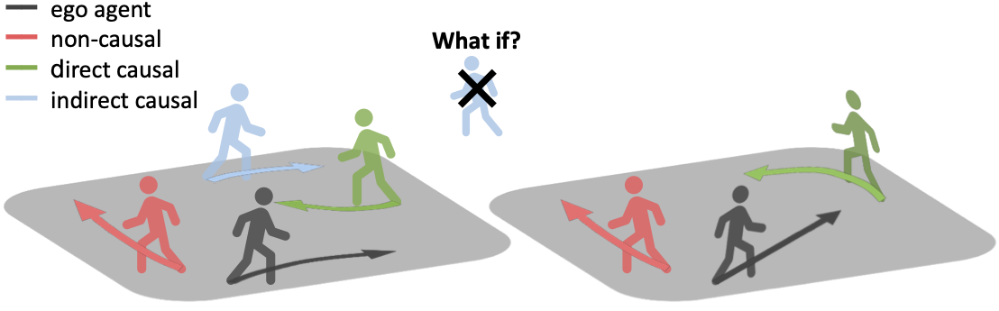
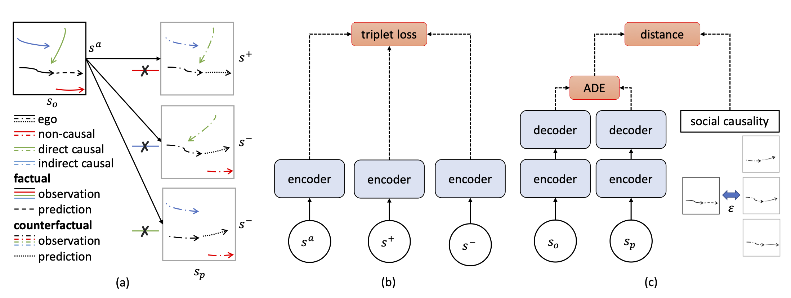

# Social Causality: Towards Causally-aware Neural Representations of Multi-agent Interactions



This repository is the official implementation
of  ["Social Causality: Towards Causally-aware Neural Representations of Multi-agent Interactions"]().

Authors: Yeujiang Liu*, Ahmad Rahimi*, Frano Rajic*, Po-Chien Luan, and Alexandre Alahi

[[arXiv]]()

## Abstract

Modeling spatial-temporal interactions between neighboring agents is at the heart of
multi-agent problems such as motion forecasting and crowd navigation. Despite notable
progress, recent neural representations of these interactions still struggle to capture the
underlying causal relationships. In this work, we take an in-depth look at the challenges
and prospects of modeling social causality in the multi-agent context. First, we cast doubt
on the notion of causal robustness in recent work. We show that modern forecasting
models are already partially resilient to perturbations of non-causal agents. Yet, certain
cases such as indirect causal effects involving mediator agents remain exceedingly difficult
to model. To address this challenge, we propose two regularizers that exploit annotations
of varying granularity. Through controlled experiments, we demonstrate the efficacy of
the proposed regularizers as well as the advantages of finer-grained annotations. Finally,
we systematically examine representations with different degrees of causal awareness in
challenging settings, including low-data regimes and distribution shifts. Our results shed
light on the crucial role of causal understanding in addressing robustness concerns in
interaction modeling.

## Method

### Contrastive Regularizer

Using contrastive learning to learn causal representations of multi-agent interactions.
Given a scene as anchor, we sample a positive scene by removing a non-causal agent from the scene, and negative scenes
by removing causal agents, one at a time.
Finally, the InfoNCE loss is used as a regularizer to learn the desired causal representation.

### Consistency Regularizer

The amount of change in the ground-truth trajectory of ego agent, after removing an agent in the scene, which we call
the causal effect, is directly used as the supervision signal for the consistency regularizer.
The amount of change in predicted trajectory is penalized if it is not consistent with the ground-truth causal effect.



## Getting Started

- [Synthetic Dataset](SynthDataset/README.md) [In progress]

- [AutoBots baseline](AutoBots/README.md)

- [Trajnet++ baseline](trajnet++/README.md) [In progress]

## Main Results

#### Comparing the performance of Directional LSTM with its regularized versions on causality metrics

| Model       | ADE   | ARS (gain)    | HNC (gain)     |
|-------------|-------|---------------|----------------|
| D-LSTM      | 0.369 | 0.047         | 6491           |
| Contrastive | 0.371 | 0.044 (+6.4%) | 5448 (+15.1%)  |
| Consistency | 0.369 | 0.042 (+10.6%)| 5229 (+19.4%)  |

#### Comparing the performance of AutoBots with its regularized versions on causality metrics when trained on 1000 scenarios

| Model       | ADE       | ARS (gain)     | HNC (gain)     |
|-------------|-----------|----------------|----------------|
| AutoBots    | 0.374     | 0.129          | 17646          |
| Contrastive | 0.373     | 0.103 (+20.2%) | 15023 (+14.8%) |
| Consistency | 0.369     | 0.123 (+4.7%)  | 16807 (+4.6%)  |

## Citation

If you find this work useful in your research, please consider cite:

```
@article{liu2023social,
  title={Social Causality: Towards Causally-aware Neural Representations of Multi-agent Interactions},
  author={Liu, Yeujiang and Rahimi, Ahmad and Rajic, Frano and Luan, Po-Chien and Alahi, Alexandre},
  journal={arXiv preprint arXiv:2106.01901},
  year={2023}
}
```