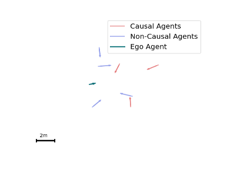

# Synth Dataset: Pedestrian Interaction Synthetic Dataset for Causality

This is just a placeholder for the synthetic dataset. The dataset will be added soon.
For internal use, you can use the `break_synth.py` script to break synth dataset we had before into smaller one-scene files.
Just change the save_path in the script to where you want the broken dataset to be saved.